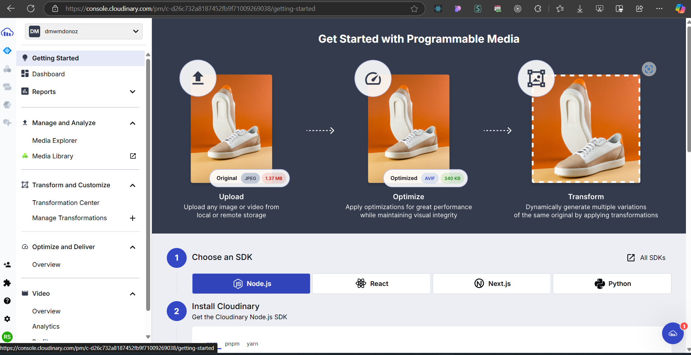

## ---------------- install the all the below dependeies -------
1) npm install @reduxjs/toolkit@^2.2.7 axios@^1.7.4 class-variance-authority@^0.7.0 clsx@^2.1.1 lucide-react@^0.429.0 react@^18.3.1 react-dom@^18.3.1 react-redux@^9.1.2 react-router-dom@^6.26.1 tailwind-merge@^2.5.2 tailwindcss-animate@^1.0.7
2) Here’s a short description for each of the dependencies:
   1) Here’s a short description for each of the dependencies:

------------------------

### **1. `@reduxjs/toolkit`**
- **Purpose**: Simplifies state management in React applications using Redux.
- **Example Use**: Managing global state (e.g., user authentication, cart items).

---

### **2. `axios`**
- **Purpose**: A promise-based HTTP client for making API requests.
- **Example Use**: Fetching data from a REST API or sending POST requests.

---

### **3. `class-variance-authority`**
- **Purpose**: Utility for managing dynamic and conditional class names with variants.
- **Example Use**: Easily applying conditional Tailwind CSS classes based on props.

---

### **4. `clsx`**
- **Purpose**: Utility for conditionally joining class names.
- **Example Use**: Dynamically assigning CSS classes in a React component.

---

### **5. `lucide-react`**
- **Purpose**: Icon library for React with lightweight and customizable icons.
- **Example Use**: Adding icons (e.g., menu, user, or settings icons) to a UI.

---

### **6. `react`**
- **Purpose**: Core library for building user interfaces.
- **Example Use**: Creating reusable components and managing UI state.

---

### **7. `react-dom`**
- **Purpose**: Provides DOM-specific methods for rendering React components to the browser.
- **Example Use**: Mounting a React app into a `div` in the HTML file.

---

### **8. `react-redux`**
- **Purpose**: Official bindings for integrating Redux with React.
- **Example Use**: Connecting React components to the Redux store.

---

### **9. `react-router-dom`**
- **Purpose**: Enables routing and navigation in React applications.
- **Example Use**: Creating routes like `/home`, `/about`, or `/dashboard`.

---

### **10. `tailwind-merge`**
- **Purpose**: Utility for merging and overriding conflicting Tailwind CSS classes.
- **Example Use**: Dynamically resolving conflicting classes like `bg-red-500` and `bg-blue-500`.

---

### **11. `tailwindcss-animate`**
- **Purpose**: Plugin for adding pre-defined animations to Tailwind CSS.
- **Example Use**: Animating elements with classes like `animate-fade-in` or `animate-bounce`.

-----------------------------------
3) Add Tailwind and its configuration:
Install tailwindcss and its peer dependencies, then generate your tailwind.config.js and postcss.config.js files: by follow the below command
4) npm install -D tailwindcss postcss autoprefixer
5) npx tailwindcss init -p
6) Add this import header in your main css file, src/index.css in our case: below code
7) @tailwind base;
    @tailwind components;
    @tailwind utilities;

    /* ... */
8) Configure the tailwind template paths in tailwind.config.js: by follow the below code:
      1) /** @type {import('tailwindcss').Config} */
      module.exports = {
        content: ["./index.html", "./src/**/*.{ts,tsx,js,jsx}"],
        theme: {
          extend: {},
        },
        plugins: [],
      }
9) Edit tsconfig.json file but we are using the js so, for that we need to create a file with same name as jsconfig.json then paste some code from that official website guild.
   1)  
                {
        "compilerOptions": {
            "baseUrl": ".",
            "paths": {
            "@/*": ["./src/*"]
            }
        }
        }

10) Update vite.config.ts/ js
Add the following code to the vite.config.ts so your app can resolve paths without error:
    1) export default defineConfig({
        plugins: [react()],
        resolve: {
            alias: {
            "@": path.resolve(__dirname, "./src"),
            },
        },
        })

11) write the below command in your local to Run the shadcn-ui init command to setup your project:
    1)  npx shadcn@latest init
12) Configure components.json
    You will be asked a few questions to configure components.json:

    Which style would you like to use? › New York
    Which color would you like to use as base color? › Zinc
    Do you want to use CSS variables for colors? › no / yes
13) That's it You can now start adding components to your project.
    1) npx shadcn@latest add button
The command above will add the Button component to your project. You can then import it like this:

14) to run this front-end app use the : npm run dev
15) 


### ----------------------------------------
20) create a input using ui.shadcn for that enter in terminal below command.. (https://ui.shadcn.com/docs/components/button)
21) => npx shadcn@latest add input select label textarea 
then output will come like below
22) Checking registry.
✔ Installing dependencies.
✔ Created 4 files:
  - src\components\ui\input.jsx
  - src\components\ui\select.jsx
  - src\components\ui\label.jsx
  - src\components\ui\textarea.jsx

23) to add the button write the below command in termilan then authometically button componnet will be created in component/ui/Button file.
24) npx shadcn@latest add button
25) npx shadcn@latest add toast


### ----------- createAsyncThunk what is the AsyncTHunk in react js redux ---------------------------

`createAsyncThunk` is a utility function provided by **Redux Toolkit** to handle asynchronous logic in a Redux application. It is commonly used in React applications for making API calls or performing other asynchronous tasks. `createAsyncThunk` simplifies the process of dispatching actions for different states of an asynchronous operation: pending, fulfilled, and rejected.

### Key Features of `createAsyncThunk`
1. Automatically generates **action types** for the `pending`, `fulfilled`, and `rejected` states of an async action.
2. Works seamlessly with `createSlice` to handle the state changes for these actions.
3. Helps manage complex async workflows in a clean and predictable way.

---

### Basic Syntax:
```javascript
import { createAsyncThunk } from '@reduxjs/toolkit';

const fetchData = createAsyncThunk('sliceName/fetchData', async (args, thunkAPI) => {
  try {
    const response = await fetch('/api/data'); // Replace with your API call
    const data = await response.json();
    return data; // This will be passed to `fulfilled` action
  } catch (error) {
    return thunkAPI.rejectWithValue(error.message); // Passes the error to `rejected` action
  }
});
```

---

### How It Works:
1. **Action States**:
   - **`fetchData.pending`**: Dispatched when the async function starts.
   - **`fetchData.fulfilled`**: Dispatched when the async function successfully completes.
   - **`fetchData.rejected`**: Dispatched when the async function fails or encounters an error.

2. **Reducer Integration**:
   Use `createSlice` to define how the `pending`, `fulfilled`, and `rejected` actions update the Redux state.

---

### Example of Usage:

#### Step 1: Define the Async Thunk
```javascript
import { createAsyncThunk } from '@reduxjs/toolkit';

export const fetchUsers = createAsyncThunk('users/fetchUsers', async (_, thunkAPI) => {
  try {
    const response = await fetch('https://jsonplaceholder.typicode.com/users');
    if (!response.ok) throw new Error('Failed to fetch users');
    return await response.json(); // Fulfilled response
  } catch (error) {
    return thunkAPI.rejectWithValue(error.message); // Rejected response
  }
});
```

#### Step 2: Create the Slice
```javascript
import { createSlice } from '@reduxjs/toolkit';
import { fetchUsers } from './userThunks';

const userSlice = createSlice({
  name: 'users',
  initialState: {
    data: [],
    loading: false,
    error: null,
  },
  reducers: {},
  extraReducers: (builder) => {
    builder
      .addCase(fetchUsers.pending, (state) => {
        state.loading = true;
        state.error = null;
      })
      .addCase(fetchUsers.fulfilled, (state, action) => {
        state.loading = false;
        state.data = action.payload;
      })
      .addCase(fetchUsers.rejected, (state, action) => {
        state.loading = false;
        state.error = action.payload;
      });
  },
});

export default userSlice.reducer;
```

#### Step 3: Dispatch the Thunk in a Component
```javascript
import React, { useEffect } from 'react';
import { useSelector, useDispatch } from 'react-redux';
import { fetchUsers } from './userThunks';

const UserList = () => {
  const dispatch = useDispatch();
  const { data, loading, error } = useSelector((state) => state.users);

  useEffect(() => {
    dispatch(fetchUsers()); // Dispatch the async thunk
  }, [dispatch]);

  if (loading) return <p>Loading...</p>;
  if (error) return <p>Error: {error}</p>;

  return (
    <ul>
      {data.map((user) => (
        <li key={user.id}>{user.name}</li>
      ))}
    </ul>
  );
};

export default UserList;
```

---

### Advantages of `createAsyncThunk`
1. **Reduces Boilerplate**: No need to manually write action types or creators for async operations.
2. **Built-in Error Handling**: Easily reject actions with `thunkAPI.rejectWithValue`.
3. **Integrates with Redux DevTools**: Provides a clear view of `pending`, `fulfilled`, and `rejected` states in your Redux DevTools.

This makes `crea+teAsyncThunk` an essential tool for managing side effects and asynchronous workflows in a Redux-powered React application.

## ------- Q?  so there is no use of middleware if we use the createAsyncThunk for the async redux or what, when we have createAsyncThunk topics -----------------

You're right to think about middleware in relation to `createAsyncThunk`, and it's a great question! While `createAsyncThunk` does handle much of the complexity of asynchronous operations in Redux, **middleware still has its place** in a Redux application. Let me clarify:

---

### Does `createAsyncThunk` Replace Middleware?
**No, `createAsyncThunk` does not completely replace middleware.** While it simplifies managing async operations, Redux middleware is still useful in specific scenarios.

Here’s why:

1. **Middleware in Redux**:
   Middleware allows you to intercept actions, add logic, and modify actions or state before they reach the reducers. Popular examples include `redux-thunk`, `redux-saga`, and custom middleware.

2. **Role of `createAsyncThunk`**:
   `createAsyncThunk` is built on top of `redux-thunk`, which is a middleware. It abstracts the complexity of writing async code (like fetching data) and automatically handles action dispatching for **pending**, **fulfilled**, and **rejected** states.

---

### When Middleware Is Still Useful
1. **Complex Workflows**:  
   If you have **complex async workflows** (e.g., chaining multiple API calls, real-time updates via WebSockets), middleware like `redux-saga` or custom middleware may still be necessary.

2. **Global Behavior**:  
   Middleware can handle global tasks, such as:
   - Logging actions and state changes.
   - Dispatching analytics events.
   - Adding headers or modifying requests before they are sent.

3. **Custom Async Logic**:  
   If your application has unique async requirements (like retrying failed API calls or handling WebSocket connections), middleware can handle that better than `createAsyncThunk`.

4. **Third-Party Libraries**:  
   Some libraries like `redux-saga` or `redux-observable` are more suitable for advanced use cases like cancellation of tasks, debounce/throttle actions, or handling background tasks.

---

### Scenarios Where `createAsyncThunk` Is Enough
If your async needs are relatively straightforward (e.g., fetching data from APIs, submitting forms), `createAsyncThunk` is usually sufficient. For example:
- Fetching users from an API.
- Submitting a form and updating the UI.
- Managing basic async flows without interdependencies.

---

### Combining `createAsyncThunk` with Middleware
You can use both `createAsyncThunk` and custom middleware together in a Redux app. For example:
- Use `createAsyncThunk` for typical async operations like API calls.
- Use middleware for custom logic, logging, analytics, or error reporting.

---

### Example: Combining Middleware with `createAsyncThunk`
```javascript
import { configureStore, createSlice, createAsyncThunk } from '@reduxjs/toolkit';
import loggerMiddleware from './loggerMiddleware'; // Custom middleware

// Async Thunk
const fetchUsers = createAsyncThunk('users/fetchUsers', async () => {
  const response = await fetch('https://jsonplaceholder.typicode.com/users');
  return response.json();
});

// Slice
const userSlice = createSlice({
  name: 'users',
  initialState: { data: [], loading: false },
  reducers: {},
  extraReducers: (builder) => {
    builder
      .addCase(fetchUsers.pending, (state) => { state.loading = true; })
      .addCase(fetchUsers.fulfilled, (state, action) => { 
        state.loading = false; 
        state.data = action.payload; 
      });
  },
});

// Middleware
const loggerMiddleware = (storeAPI) => (next) => (action) => {
  console.log('Dispatching:', action.type);
  const result = next(action);
  console.log('Next State:', storeAPI.getState());
  return result;
};

// Configure Store
const store = configureStore({
  reducer: { users: userSlice.reducer },
  middleware: (getDefaultMiddleware) => getDefaultMiddleware().concat(loggerMiddleware), // Adding middleware
});

export default store;
```

---

### Conclusion
`createAsyncThunk` makes most async Redux workflows simple, but middleware is still essential for tasks that require **global behavior** or **complex logic**. You can combine both for a powerful and scalable Redux setup.


### Q-3: ------------ extraReducers: (builder) => {
    builder
      .addCase(fetchUsers.pending, (state) => {
        state.loading = true;
        state.error = null;
      })
      .addCase(fetchUsers.fulfilled, (state, action) => {
        state.loading = false;
        state.data = action.payload;
      }) here what is this extraReducers and this all

## ans ---
### What is `extraReducers` in Redux Toolkit?

`extraReducers` is a property you use in a Redux Toolkit slice (`createSlice`) to handle actions that are **not directly defined within the slice's reducers**. It is commonly used to handle **actions generated by external logic**, like those created by `createAsyncThunk`.

When you create an async thunk using `createAsyncThunk`, Redux Toolkit automatically generates three action types for you:
1. **`pending`**: Dispatched when the async function starts.
2. **`fulfilled`**: Dispatched when the async function resolves successfully.
3. **`rejected`**: Dispatched when the async function fails.

You use `extraReducers` to listen for and handle these actions in your slice.

---

### Breakdown of the Example Code

```javascript
extraReducers: (builder) => {
    builder
      .addCase(fetchUsers.pending, (state) => {
        state.loading = true; // Sets loading to true while the async task is running
        state.error = null;  // Resets error to null in case of retry
      })
      .addCase(fetchUsers.fulfilled, (state, action) => {
        state.loading = false;         // Loading is done
        state.data = action.payload;  // Store the data returned by the API
      })
      .addCase(fetchUsers.rejected, (state, action) => {
        state.loading = false;         // Loading is done
        state.error = action.payload; // Save the error message
      });
}
```

#### Key Concepts:

1. **`fetchUsers.pending`**:
   - This action is automatically dispatched when `fetchUsers` starts executing (e.g., an API call is made).
   - In this case, we update the state to reflect that the operation is in progress (`loading: true`) and reset any previous errors.

2. **`fetchUsers.fulfilled`**:
   - This action is automatically dispatched when `fetchUsers` resolves successfully.
   - The `action.payload` contains the response data from the async function, and we store it in the Redux state.

3. **`fetchUsers.rejected`**:
   - This action is automatically dispatched when `fetchUsers` fails (e.g., a network error occurs).
   - The `action.payload` contains the error message (if `rejectWithValue` is used in the thunk).

---

### Why Use `extraReducers`?

You need `extraReducers` when:
1. You want your slice to **respond to actions from other slices** or **external logic**, such as `createAsyncThunk`.
2. You want to listen to actions that are **not defined in the `reducers` property** of the slice.

For example:
- `reducers` defines the actions the slice itself can trigger and handle.
- `extraReducers` listens for actions triggered outside the slice, like async thunks or other slices.

---

### How Does `extraReducers` Work?

#### The `builder` Callback
The `builder` parameter in `extraReducers` provides an **API to add cases for specific actions**. You can:
- Use `.addCase(actionType, callback)` to handle a specific action.
- Use `.addMatcher()` to handle multiple actions matching a condition.
- Use `.addDefaultCase()` to handle any other actions.

---

### Full Example

Here’s a complete example with an API call using `extraReducers`:

#### 1. Thunk to Fetch Users
```javascript
import { createAsyncThunk, createSlice } from '@reduxjs/toolkit';

// Async thunk to fetch users
export const fetchUsers = createAsyncThunk(
  'users/fetchUsers',
  async (_, thunkAPI) => {
    try {
      const response = await fetch('https://jsonplaceholder.typicode.com/users');
      if (!response.ok) throw new Error('Failed to fetch users');
      return await response.json(); // This becomes `action.payload` in `fulfilled`
    } catch (error) {
      return thunkAPI.rejectWithValue(error.message); // This becomes `action.payload` in `rejected`
    }
  }
);
```

#### 2. Slice with `extraReducers`
```javascript
const userSlice = createSlice({
  name: 'users',
  initialState: {
    data: [],
    loading: false,
    error: null,
  },
  reducers: {}, // No direct actions defined here
  extraReducers: (builder) => {
    builder
      .addCase(fetchUsers.pending, (state) => {
        state.loading = true;
        state.error = null;
      })
      .addCase(fetchUsers.fulfilled, (state, action) => {
        state.loading = false;
        state.data = action.payload; // Populate state with fetched data
      })
      .addCase(fetchUsers.rejected, (state, action) => {
        state.loading = false;
        state.error = action.payload; // Populate state with error message
      });
  },
});

export default userSlice.reducer;
```

#### 3. Using the Thunk in a Component
```javascript
import React, { useEffect } from 'react';
import { useSelector, useDispatch } from 'react-redux';
import { fetchUsers } from './userSlice';

const UserList = () => {
  const dispatch = useDispatch();
  const { data, loading, error } = useSelector((state) => state.users);

  useEffect(() => {
    dispatch(fetchUsers()); // Dispatch the async thunk
  }, [dispatch]);

  if (loading) return <p>Loading...</p>;
  if (error) return <p>Error: {error}</p>;

  return (
    <ul>
      {data.map((user) => (
        <li key={user.id}>{user.name}</li>
      ))}
    </ul>
  );
};

export default UserList;
```

---

### Summary

- **`extraReducers`** is used to handle actions generated **outside the slice** (e.g., `createAsyncThunk` actions like `pending`, `fulfilled`, `rejected`).
- It listens for these actions and updates the state based on their type.
- It works with the `builder` API to define how specific actions affect the slice's state.

This mechanism makes it easy to manage async logic in Redux Toolkit while keeping your code clean and maintainable.


### --------------- here the useToast or Toaster used to display the toster ---------------------


## -------------- 
1)  download the skeleton to apply the loader 
2)  npx shadcn@latest add skeleton
3)  or install the  npm i react-loader-spinner 
4)  


## ---- working with admin pannel -------------------------
1) to download some icons ffollow this website we can use the react-icons also
2) https://lucide.dev/icons/
3) now download the sheet componnet from the  https://ui.shadcn.com/docs/components/sheet for that write the below command
4) npx shadcn@latest add sheet
5) to install the Cart 
6) npx shadcn@latest add card
7) to store the uploaded image in cloud we have to use the  https://cloudinary.com/home 
8) 
9) 
10) to use the cloudinary first we have to download the dependency of it which is already done
11) then first select the Choose an SDK either node-js, python, java, react-js, next-js etc
12) in out application we are going to use the node-js SDK
13) then Install Cloudinary to Get the Cloudinary Node.js SDK by using the below command
14) npm i cloudinary
15) then Upload, Optimize and Transform:> for that we need to confure the Cloud name , API key,API secret	, API environment variable into our application 
16) --------------- so work with backend now-----------------------------------
17) 


### ------------------------- explanning the slice, createAsyncThunk and extraReducers ------------------------------

18) Explanation of store/auth-slice/index.js code....
19) This code defines a Redux slice using `@reduxjs/toolkit` for managing authentication state, including user registration, login, logout, and authentication status checking.

### **Explanation**

1. **Initial State (`initialState`)**:
   - `isAuthenticated`: Indicates if the user is authenticated (`true` or `false`).
   - `isLoading`: Tracks whether an async action (e.g., login) is in progress.
   - `user`: Stores user data after successful authentication.

2. **Asynchronous Actions (via `createAsyncThunk`)**:
   - `createAsyncThunk` simplifies the process of defining async actions. Each thunk has three states: `pending`, `fulfilled`, and `rejected`.

   - **`registerUser`:** Handles user registration.
     - Sends a `POST` request to `/api/auth/register`.
     - Returns the response data if the request is successful.
   - **`loginUser`:** Handles user login.
     - Sends a `POST` request to `/api/auth/login`.
     - Updates state with the response data.
   - **`logoutUser`:** Logs the user out.
     - Sends a `POST` request to `/api/auth/logout`.
   - **`checkAuth`:** Checks if the user is authenticated.
     - Sends a `GET` request to `/api/auth/check-auth`.

3. **Slice (`authSlice`)**:
   - Defines the slice name (`auth`) and state.
   - Contains:
     - Reducer logic (`reducers`): For synchronous actions (e.g., `setUser` to manually set the user in state).
     - `extraReducers`: For handling asynchronous thunks.

4. **Extra Reducers**:
   - **`registerUser`**:
     - Pending: Sets `isLoading` to `true`.
     - Fulfilled/Rejected: Sets `isLoading` to `false`, clears `user`, and marks `isAuthenticated` as `false`.
   - **`loginUser`**:
     - Pending: Starts the loading spinner.
     - Fulfilled: Updates `user` and `isAuthenticated` based on the response.
     - Rejected: Resets the state on failure.
   - **`checkAuth`**:
     - Handles the same states as `loginUser` but for checking authentication.
   - **`logoutUser`**:
     - Clears the state and resets `isAuthenticated`.

5. **Exported Components**:
   - `setUser`: A synchronous reducer to set user data manually.
   - Default export: The reducer function for integration into the Redux store.

---

### **Alternative Ways to Write This**

1. **Custom Middleware Approach**:
   - Instead of `createAsyncThunk`, you could use plain Redux actions with custom middleware like `redux-thunk` to handle async operations. Example:
     ```javascript
     export const loginUser = (formData) => async (dispatch) => {
       try {
         dispatch({ type: "auth/loginPending" });
         const response = await axios.post("http://localhost:5000/api/auth/login", formData, { withCredentials: true });
         dispatch({ type: "auth/loginSuccess", payload: response.data });
       } catch (error) {
         dispatch({ type: "auth/loginFailure", payload: error.message });
       }
     };
     ```

2. **Use React Query**:
   - Instead of Redux for async calls, use **React Query**. It simplifies data fetching, caching, and state updates:
     ```javascript
     import { useMutation, useQuery } from "react-query";

     const login = async (formData) => {
       const response = await axios.post("http://localhost:5000/api/auth/login", formData, { withCredentials: true });
       return response.data;
     };

     const { mutate: loginUser } = useMutation(login, {
       onSuccess: (data) => console.log("Login successful!", data),
       onError: (error) => console.error("Login failed!", error),
     });
     ```

3. **RTK Query**:
   - `@reduxjs/toolkit` also includes **RTK Query**, a more declarative way to handle API calls directly in Redux:
     ```javascript
     import { createApi, fetchBaseQuery } from "@reduxjs/toolkit/query/react";

     export const authApi = createApi({
       reducerPath: "authApi",
       baseQuery: fetchBaseQuery({ baseUrl: "http://localhost:5000/api" }),
       endpoints: (builder) => ({
         loginUser: builder.mutation({
           query: (formData) => ({
             url: "/auth/login",
             method: "POST",
             body: formData,
             credentials: "include",
           }),
         }),
       }),
     });

     export const { useLoginUserMutation } = authApi;
     ```

   - This reduces the need for manual `createAsyncThunk` and state handling.

### **Which Approach to Choose?**
- Use **RTK Query** or **React Query** if your project is heavily reliant on API calls and you want a simpler way to manage server state.
- Stick to `createAsyncThunk` if you're already using Redux Toolkit and need fine-grained control over loading states.

20) ## ------- so here what is role of creating createAsyncThunk in async redux basically we are using the middleware to fetch the data from api in async redux but here we have use the createAsyncThunk why ? ------
21)  ans ----- The role of `createAsyncThunk` in Redux Toolkit is to simplify the process of handling asynchronous actions in Redux, particularly when dealing with API calls. It abstracts away the complexity of managing different states (loading, success, error) manually and integrates seamlessly with Redux's `extraReducers`.

Here’s why `createAsyncThunk` is used:

---

### **1. Simplifies Async Redux Logic**
Without `createAsyncThunk`, you would typically have to:
1. Dispatch a `loading` action before starting an API request.
2. Dispatch a `success` action when the API request succeeds.
3. Dispatch a `failure` action when the API request fails.

Example **without `createAsyncThunk`:**

```javascript
const loginUser = (formData) => async (dispatch) => {
  dispatch({ type: "auth/loginPending" });

  try {
    const response = await axios.post(
      "http://localhost:5000/api/auth/login",
      formData,
      { withCredentials: true }
    );
    dispatch({ type: "auth/loginSuccess", payload: response.data });
  } catch (error) {
    dispatch({ type: "auth/loginFailure", payload: error.message });
  }
};
```

Here, you manually define multiple actions (`loginPending`, `loginSuccess`, `loginFailure`) and handle them in your reducer. **`createAsyncThunk` automates this entire flow.**

---

### **2. Automatic Action Type Creation**
When you use `createAsyncThunk`, it automatically generates three action types:
- `pending` (for when the request starts)
- `fulfilled` (for when the request succeeds)
- `rejected` (for when the request fails)

Example with `createAsyncThunk`:

```javascript
export const loginUser = createAsyncThunk(
  "auth/login", // Action type prefix
  async (formData) => {
    const response = await axios.post(
      "http://localhost:5000/api/auth/login",
      formData,
      { withCredentials: true }
    );
    return response.data; // Data is passed to the fulfilled state
  }
);
```

Now, these actions are automatically available:
- `auth/login/pending`
- `auth/login/fulfilled`
- `auth/login/rejected`

You no longer need to define these action types manually.

---

### **3. Integration with `extraReducers`**
Using `extraReducers`, you can handle the `pending`, `fulfilled`, and `rejected` states without creating additional boilerplate actions or reducers.

```javascript
const authSlice = createSlice({
  name: "auth",
  initialState,
  extraReducers: (builder) => {
    builder
      .addCase(loginUser.pending, (state) => {
        state.isLoading = true; // Handles loading state
      })
      .addCase(loginUser.fulfilled, (state, action) => {
        state.isLoading = false;
        state.isAuthenticated = true; // Success state
        state.user = action.payload;
      })
      .addCase(loginUser.rejected, (state) => {
        state.isLoading = false;
        state.isAuthenticated = false; // Failure state
      });
  },
});
```

With this approach:
- You only focus on the result of the API call (`pending`, `fulfilled`, `rejected`).
- You don't need to write explicit actions like `loginPending`, `loginSuccess`, and `loginFailure`.

---

### **4. Built-in Error Handling**
`createAsyncThunk` automatically catches errors during the async operation and passes them to the `rejected` state. You can access the error details in the `rejected` reducer:

```javascript
builder.addCase(loginUser.rejected, (state, action) => {
  state.isLoading = false;
  state.error = action.error.message; // Captures the error message
});
```

This eliminates the need for wrapping your `async` code in `try/catch` blocks.

---

### **5. Centralized Async Logic**
`createAsyncThunk` keeps your API request logic centralized and reusable. The thunk function (`async (formData) => { ... }`) contains all the logic for making the request and returning the response. This logic is shared across your application without being tightly coupled to a component.

---

### **6. Predictable Async Flow**
The standardized `pending -> fulfilled -> rejected` flow ensures consistency and readability in how asynchronous actions are handled across your app.

---

### **Why Use `createAsyncThunk` Instead of Plain Middleware?**
While plain middleware (like `redux-thunk`) can also handle async logic, `createAsyncThunk`:
1. **Reduces Boilerplate**: No need to write custom action creators or types for each API call.
2. **Improves Code Maintainability**: The structure is predictable, making it easier for developers to understand and maintain.
3. **Built-in Error Handling**: Error states are directly integrated.
4. **Easier Debugging**: The generated action types (e.g., `auth/login/pending`) help with debugging in tools like Redux DevTools.

---

### **When NOT to Use `createAsyncThunk`?**
- For very complex use cases, where you need fine-grained control over the request or have multiple dependent async actions.
- When using libraries like React Query or RTK Query, which are specifically designed for handling API state.

In most cases, however, **`createAsyncThunk` is the preferred way** for handling asynchronous logic in Redux Toolkit. It strikes the right balance between simplicity and flexibility.

22) ## - Q --------------- good thank but is that createAsyncThunk will be handled by extraReducers only ? ----------
23)  ans -Yes, `createAsyncThunk` is typically handled by `extraReducers` in Redux Toolkit. This is because `extraReducers` is designed to handle actions that are not explicitly defined in the `reducers` field of a slice. The action types (`pending`, `fulfilled`, `rejected`) generated by `createAsyncThunk` fall into this category since they are created dynamically.

---

### **How `createAsyncThunk` Works with `extraReducers`**

When you create a thunk using `createAsyncThunk`, Redux Toolkit automatically generates three action types:
1. `<actionName>/pending`
2. `<actionName>/fulfilled`
3. `<actionName>/rejected`

These action types need to be handled somewhere to update the state accordingly. `extraReducers` provides a clean way to handle them because it allows you to respond to actions not defined directly in the slice's `reducers`.

#### Example:

```javascript
const authSlice = createSlice({
  name: "auth",
  initialState,
  reducers: {}, // No need to define anything here for createAsyncThunk
  extraReducers: (builder) => {
    builder
      .addCase(loginUser.pending, (state) => {
        state.isLoading = true;
      })
      .addCase(loginUser.fulfilled, (state, action) => {
        state.isLoading = false;
        state.isAuthenticated = true;
        state.user = action.payload;
      })
      .addCase(loginUser.rejected, (state) => {
        state.isLoading = false;
        state.error = "Login failed"; // Or capture error details from action.error
      });
  },
});
```

Here, `extraReducers` listens for the `loginUser` thunk's `pending`, `fulfilled`, and `rejected` states.

---

### **Can `createAsyncThunk` Be Handled Without `extraReducers`?**

While `extraReducers` is the standard approach, you can technically handle `createAsyncThunk` action types elsewhere, such as in a `reducers` field or even in custom middleware. However, this is **not recommended** because it makes your code less readable and deviates from Redux Toolkit's best practices.

#### Example: Handling Thunks Without `extraReducers` (Not Recommended)
You could dispatch `createAsyncThunk` actions and manually handle them using `reducers`, but this requires knowing the specific action types:

```javascript
const authSlice = createSlice({
  name: "auth",
  initialState,
  reducers: {
    // Example of manually handling one of the thunk's action types
    handleLoginFulfilled: (state, action) => {
      if (action.type === "auth/login/fulfilled") {
        state.isLoading = false;
        state.isAuthenticated = true;
        state.user = action.payload;
      }
    },
  },
});
```

This approach adds unnecessary complexity and defeats the purpose of using `createAsyncThunk` for predictable, standardized async flow.

---

### **Why Use `extraReducers`?**
1. **Decouples State Logic from Actions**: The slice doesn’t need to "own" the actions generated by `createAsyncThunk`.
2. **Built for Async Handling**: `extraReducers` is specifically designed to handle external actions (like `createAsyncThunk` actions) efficiently.
3. **Clean and Readable**: The async flow is easy to follow with `pending`, `fulfilled`, and `rejected` handled explicitly in `extraReducers`.

---

### **Advanced Example: Handling Multiple Thunks**

You can handle multiple `createAsyncThunk` thunks within the same slice using `extraReducers`. For instance:

```javascript
const authSlice = createSlice({
  name: "auth",
  initialState,
  extraReducers: (builder) => {
    builder
      // Handle registerUser thunk
      .addCase(registerUser.pending, (state) => {
        state.isLoading = true;
      })
      .addCase(registerUser.fulfilled, (state, action) => {
        state.isLoading = false;
        state.isAuthenticated = true;
        state.user = action.payload;
      })
      .addCase(registerUser.rejected, (state) => {
        state.isLoading = false;
        state.error = "Registration failed";
      })
      // Handle loginUser thunk
      .addCase(loginUser.pending, (state) => {
        state.isLoading = true;
      })
      .addCase(loginUser.fulfilled, (state, action) => {
        state.isLoading = false;
        state.isAuthenticated = true;
        state.user = action.payload;
      })
      .addCase(loginUser.rejected, (state) => {
        state.isLoading = false;
        state.error = "Login failed";
      });
  },
});
```

In this example:
- Both `registerUser` and `loginUser` thunks are handled using `extraReducers`.
- Each thunk has its own `pending`, `fulfilled`, and `rejected` cases, ensuring proper state management.

---

### **Conclusion**
`createAsyncThunk` works best when paired with `extraReducers`, as it provides a clean and efficient way to manage the states (`pending`, `fulfilled`, `rejected`) of asynchronous actions. While it is possible to handle the action types elsewhere, doing so would introduce unnecessary complexity and go against Redux Toolkit’s design philosophy of reducing boilerplate and improving code readability.

23) ### ----------------------- explaning of the components/config/index.js code ---------------------
24) This code defines a set of JavaScript objects and arrays that serve as **configuration and metadata** for various forms, menus, filters, and UI elements in a web application. Here's a breakdown of the purpose of each export:

---

### **1. `registerFormControls` and `loginFormControls`**
- These arrays define the input fields for **registration** and **login** forms.
- Each object in the array describes the properties of a form field, such as:
  - `name`: The key for managing form state.
  - `label`: The label text displayed above the field.
  - `placeholder`: Placeholder text inside the field.
  - `componentType`: The type of UI component (e.g., `input` or `textarea`).
  - `type`: The HTML input type (e.g., `text`, `email`, `password`).

#### Example Use:
These objects can be dynamically used in form generation:
```jsx
registerFormControls.map((control) => (
  <Input
    key={control.name}
    label={control.label}
    placeholder={control.placeholder}
    type={control.type}
  />
));
```

---

### **2. `addProductFormElements`**
- Defines the structure for an **add product form** with a variety of input types:
  - `input`: For basic fields like title, price, and stock.
  - `textarea`: For a multi-line input like description.
  - `select`: For dropdowns like category and brand.
  - `options`: Nested arrays for dropdown choices.

#### Example Use:
Generate a dynamic product form:
```jsx
addProductFormElements.map((field) => {
  if (field.componentType === "select") {
    return (
      <Select key={field.name} label={field.label} options={field.options} />
    );
  }
  if (field.componentType === "textarea") {
    return <TextArea key={field.name} label={field.label} />;
  }
  return <Input key={field.name} label={field.label} type={field.type} />;
});
```

---

### **3. `shoppingViewHeaderMenuItems`**
- Represents the **menu items** for a shopping view's navigation header.
- Each object contains:
  - `id`: A unique identifier for the menu item.
  - `label`: The text displayed for the menu item.
  - `path`: The route/path it links to.

#### Example Use:
Render a navigation bar:
```jsx
shoppingViewHeaderMenuItems.map((item) => (
  <NavLink key={item.id} to={item.path}>
    {item.label}
  </NavLink>
));
```

---

### **4. `categoryOptionsMap` and `brandOptionsMap`**
- These objects map IDs to readable labels for **categories** and **brands**.
- Useful for displaying labels or translating between IDs and text.

#### Example Use:
```javascript
const categoryLabel = categoryOptionsMap["men"]; // Outputs: "Men"
```

---

### **5. `filterOptions`**
- Defines filter criteria for a product listing page.
- Two filter types:
  - `category`: Options like Men, Women, Kids, etc.
  - `brand`: Options like Nike, Adidas, Puma, etc.

#### Example Use:
Render filters dynamically:
```jsx
filterOptions.category.map((option) => (
  <Checkbox key={option.id} label={option.label} value={option.id} />
));
```

---

### **6. `sortOptions`**
- Provides sorting options for a product listing page.
- Each object contains:
  - `id`: A unique identifier for the sorting option.
  - `label`: The text displayed in the UI.

#### Example Use:
Render a sorting dropdown:
```jsx
<Select options={sortOptions} />
```

---

### **7. `addressFormControls`**
- Specifies input fields for an **address form**.
- Similar to `registerFormControls`, it includes:
  - `name`, `label`, `type`, `placeholder`, and `componentType`.

#### Example Use:
```jsx
addressFormControls.map((control) => (
  <Input key={control.name} label={control.label} type={control.type} />
));
```

---

### **Purpose of These Structures**
- **Dynamic UI Generation**: These arrays and objects are designed to enable dynamic rendering of forms, menus, filters, and other UI components.
- **Reusability**: By centralizing configurations, you avoid hardcoding the same fields or options repeatedly.
- **Separation of Concerns**: Keeps UI logic separate from configuration, improving maintainability.
- **Scalability**: New fields, options, or menu items can be easily added by modifying these configurations without touching the rendering logic.

---

### **Real-World Benefits**
1. **Customization**: Easy to add or update form fields, filters, or menu items by modifying a single source of truth.
2. **Localization/Internationalization**: Can easily support multiple languages by mapping labels dynamically.
3. **DRY Principle**: Avoids duplication of form field definitions across the codebase.

24) #### ------- explanning the components/common/form.jsx code -------------------
25) ans - The `CommonForm` component is a reusable React component that dynamically renders a form based on the input configuration (`formControls`). Here's a detailed explanation of the code:

---

### **Props**
1. **`formControls`**: 
   - An array of objects, where each object defines the structure of a form field (e.g., `name`, `type`, `componentType`, `placeholder`, `label`, etc.).  
   - Example: `registerFormControls`, `addProductFormElements`.

2. **`formData`**: 
   - An object holding the current state of the form's input values. The keys are the names of the fields, and the values are the corresponding input values.

3. **`setFormData`**: 
   - A function to update the `formData` state when the input values change. Typically passed down from the parent component.

4. **`onSubmit`**: 
   - A callback function to handle the form's submission.

5. **`buttonText`**: 
   - A string representing the text displayed on the submit button.

6. **`isBtnDisabled`**: 
   - A boolean to enable or disable the submit button.

---

### **Key Functionality**

#### **`renderInputsByComponentType(getControlItem)`**
This function renders the appropriate form field based on the `componentType` specified in the configuration for each field.

- **Logic**:
  - `componentType` determines the type of UI component to render:
    - `"input"` → Renders an `<Input>` field.
    - `"select"` → Renders a `<Select>` dropdown.
    - `"textarea"` → Renders a `<Textarea>`.
    - Any other type defaults to `<Input>`.

- **How it works**:
  - Each component is linked to the `formData` state. When the user interacts with the field, it updates the corresponding key in the `formData` object via the `setFormData` function.
  - Example:
    ```jsx
    onChange={(event) =>
      setFormData({
        ...formData,
        [getControlItem.name]: event.target.value,
      })
    }
    ```

- **Rendering `Select`**:
  - If `componentType` is `"select"`, it renders a dropdown using `Select`, `SelectTrigger`, and `SelectContent` components.
  - The `options` property in the configuration is mapped to individual `SelectItem`s.

---

#### **`CommonForm` JSX Structure**
1. **Form (`<form>`)**:
   - Handles the `onSubmit` logic when the form is submitted.

2. **Form Fields (`formControls.map(...)`)**:
   - Loops over `formControls` to render each field dynamically.
   - Each field consists of:
     - A `<Label>` for the field.
     - The corresponding input field rendered via `renderInputsByComponentType`.

3. **Submit Button (`<Button>`)**:
   - A button for form submission.
   - It can be disabled based on the `isBtnDisabled` prop.
   - The button text is dynamic, defaulting to `"Submit"` if no `buttonText` is provided.

---

### **Dynamic Input Rendering**
Here’s how the form fields are rendered dynamically:
- **Input Example**:
  ```jsx
  <Input
    name="userName"
    placeholder="Enter your user name"
    id="userName"
    type="text"
    value={formData.userName || ""}
    onChange={(event) =>
      setFormData({
        ...formData,
        userName: event.target.value,
      })
    }
  />
  ```
- **Select Example**:
  ```jsx
  <Select
    onValueChange={(value) =>
      setFormData({
        ...formData,
        category: value,
      })
    }
    value={formData.category || ""}
  >
    <SelectTrigger className="w-full">
      <SelectValue placeholder="Category" />
    </SelectTrigger>
    <SelectContent>
      {options.map((option) => (
        <SelectItem key={option.id} value={option.id}>
          {option.label}
        </SelectItem>
      ))}
    </SelectContent>
  </Select>
  ```
- **Textarea Example**:
  ```jsx
  <Textarea
    name="description"
    placeholder="Enter product description"
    id="description"
    value={formData.description || ""}
    onChange={(event) =>
      setFormData({
        ...formData,
        description: event.target.value,
      })
    }
  />
  ```

---

### **Usage Example**
Here’s how you might use `CommonForm` in a parent component:
```jsx
import CommonForm from "./CommonForm";
import { addProductFormElements } from "./formControls";

function AddProductForm() {
  const [formData, setFormData] = useState({});
  
  const handleSubmit = (e) => {
    e.preventDefault();
    console.log("Form Submitted:", formData);
  };

  return (
    <CommonForm
      formControls={addProductFormElements}
      formData={formData}
      setFormData={setFormData}
      onSubmit={handleSubmit}
      buttonText="Add Product"
      isBtnDisabled={false}
    />
  );
}
```

---

### **Key Features**
1. **Reusability**:
   - The form adapts dynamically based on the `formControls` configuration. This eliminates the need to hardcode individual forms.

2. **Dynamic State Handling**:
   - `formData` state is updated dynamically based on the input field being modified.

3. **Seamless Integration**:
   - Can be integrated with different UI libraries and designs, like `shadcn/ui` in this case.

4. **Customization**:
   - Easily customizable with props (`buttonText`, `isBtnDisabled`, etc.) and different configurations for `formControls`.

---

This component is designed to handle forms with varied fields (inputs, dropdowns, text areas, etc.) efficiently, making it ideal for use in projects with dynamic or repetitive forms.

25) ## --- woring with shopping components -------------------------------------------